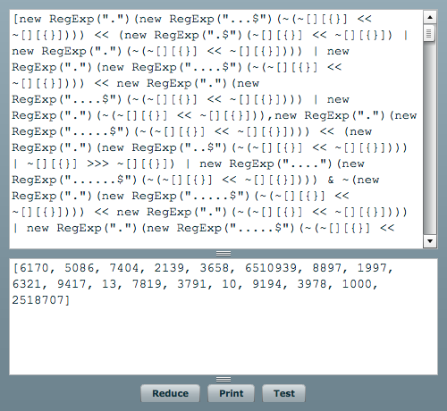
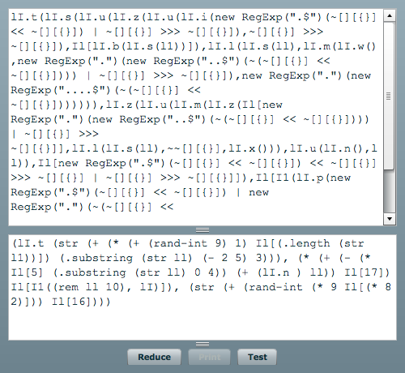

玩舰娘后，曾用 [Clojure][0] 写过一个自动远征的程序 [kancolle-worker][1]。


这个程序在 Clojure 的 REPL 中提供主要的舰娘 api 及基本的游戏逻辑模型，懂 Clojure 的人很容易写出一个自动远征程序。


后来舰娘的主要 api 添加了一个校验参数: api_port ，用于屏蔽第三方挂机程序。该参数的生成算法是混淆过的，不易阅读。如果要继续使用外挂程序，就必须疏理一下诸如下面这种代码，然后用其他语言实现。

<span class="more"></span>

```javascript
new RegExp(".")(new RegExp("...$")(~(~[][{}] << ~[][{}])))
```

这是一段表示字符串 `"6"` 的代码。通过观察上面的表达式，发现其中所有的项都是常量，那么表达式的结果也应该是个常量。进一步分析各个表达式。
`[][{}]` 为 `null`，`~null` 为 `-1`，`-1 << -1` 为 `-2147483648`，`~(-2147483648)` 为 `2147483647`，`(new RegExp("...$")(2147483647)` 为 `"647"` （转换成字符串后取末尾3个字符），`new RegExp(".")("647")` 为 `"6"` (取第一个字符)。

这种常量混淆形式比较新颖。

自从 Air SDK 从 Flex 编译工具中独立出来后，添加了许多功能。其中就有一个基本的常量折叠功能。常量折叠就是把代码中的常量表达式替换为表达式的最终结果，这样就省去了运行时的计算，对程序的运行效率有所提升。比如 `var a:int = 1 + 1;` 编译后与 `var a:int = 2;` 一样。我试过用 Air SDK 重新编译上面的表达式，发现没有被折叠。原因可能是上面的常量混淆利用了 as3语言的一些隐式的类型转换，以及空数组与空对象、正则表达式的的特性，超出了编译器的常量判定能力。


有个简便的方法可以计算表达式 `~(~[][{}] << ~[][{}])` 的结果。就是打开 Chrome 的 JS console, 运行上面的代码。正则表达式直接匹配则是 as3 语言的特性，JS 无法运行。`/./"234"` 在 as3中 是合理的表达式，结果是 `"2"`，在 JS 中是错误的式子。

为了快速得到混淆前的代码，我编写了这个 [Flash][2] 程序，它可以将舰娘的混淆代码简化。使用效果如图：

图中的常量是部分上周舰娘的代码。

除此以外，舰娘的另一类代码混淆是将简单的运算符替换成函数调用。比如将 `x + y` 替换成 `k.a(x, y)`。这种方法与上面的混淆方法共同使用，产生的代码极难阅读。所以我写的 Flash 代码分析工具加入了表达式重新打印功能。效果如图: 

图中的代码是部分上周舰娘的代码。它将常量折叠，并且将函数调用替换成 S-表达式，与 Clojure 的代码相差无几。

Flash 程序是用编译器生成工具所写，主要源码在附录。

它的主要目的在于分析舰娘中混淆的代码并转换为可读形式，所以并不是一个完整的语言。所涉及的运算符仅限于混淆代码使用的运行符。为了方便，正则表达式的调用写入了语法中。常量表达式与变量表达式在生成式中就分开了（ `Expr` 与 `VExpr` ）。最后，纠正了某 Flash 反编译工具导出的代码的一个运行符优先级问题。

有了这个工具，加密后的算法会更快分析出来，自动远征程序又可以愉快地运行了。同时说一句：外挂有风险，使用需要谨慎。

附1：工具使用方法
  1. 从舰娘主程中分离出 Core.swf
  2. 用工具反编译出 api_port 类
  3. 使用我的工具分析其算法

附2：词法、语法源码
```perl
/**
js tokens
**/
%lex

%class JsLexer
%package org.lala.gen

%%
[ \r\n\t]			/* skip whitespace */

0x[0-9a-fA-F]+		$$ = parseInt($$); return "hex";
\d+		$$ = parseInt($$); return 'int';
new     return 'new'
RegExp  return 'RegExp'
[a-zA-Z_$@][\w_$@]* return 'id'
'[^']*'|"[^"]*" $$ = $$.substr(1, yyleng - 2); return 'string';

/** flowing with div **/
)		return ')'
]		return ']'
}		return '}'
~		return '~'

false	$$ = false; return 'boolean'
true	$$ = true; return 'boolean'
null	$$ = null; return 'null'

/** flowing with regexp **/
&		return '&'
\(		return '('
*		return '*'
+		return '+'
,		return ','
-		return '-'
\.		return '.'
/		return '/'
;		
\<<		return '<<'
=		
>>		return '>>'
>>>		return '>>>'
\[		return '['
{		return '{'
|		return '|'

/** div **/
[_$a-zA-Z][_$a-zA-Z0-9]*	return 'id'

.		return 'other';

%%

/lex

%class JsParser
%package org.lala.gen
/* %import org.lala.gen.JsLexer */
%lexer_name org.lala.gen.JsLexer 

%start VExpr

%left ','
%left '|'
%left '&'
%left '<<' '>>'
%left '>>>'
%left '+' '-'
%left '*' '/'
%left '~'
%left 'new'
%left '(' '[' ']' '{' '}'
%right ')'

%%
VExpr /* 变量表式 */
	: Expr %prec new
	| id '.' id '(' ArgList ')' { $$ = ['mcall', $1, $3, $5]; }
	| id '(' ArgList ')' { $$ = ['call', $1, $3]; }
	| id
	| '(' VExpr ')' { $$ = $2; }
	| VExpr '[' VExpr ']' { $$ = ['index', $1, $3]; }
	;
	
ArgList
	: { $$ = []; }
	| VExpr { $$ = [$1]; }
	| ArgList ',' VExpr { $1.push($3); $$ = $1; }
	;
	
Expr /* 常量表达式 */
	: Number { $$ = $1; }
	| '(' Expr ')' { $$ = $2; }
	| Expr '+' Expr { $$ = $1 + $3; }
	| Expr '|' Expr { $$ = $1 | $3; }
	| Expr '&' Expr { $$ = $1 & $3; }
	| Expr '-' Expr { $$ = $1 - $3; }
	| Expr '*' Expr { $$ = $1 * $3; }
	| Expr '/' Expr { $$ = $1 / $3; }
	| Expr '<<' Expr { $$ = $1 << $3; }
	| Expr '>>' Expr { $$ = $1 >> $3; }
	| Expr '>>>' Expr { $$ = $1 >>> $3; }
	| '~' Expr { $$ = ~$2; }
	| '-' Expr %prec '~' { $$ = -$2 }
	| Array
	| Expr '[' Expr ']' { $$ = $1[$3]; }
	| '{' '}' { $$ = {}; }
	| new 'RegExp' '(' string ')' Expr { $$ = Number(String($6).match(new RegExp($4))[0]); }
	;
	
Array
	: '[' ArrayList ']' { $$ = $2; }
	;
	
ArrayList
	: { $$ = [] }
	| Expr ',' ArrayList { $3.unshift($1); $$ = $3; }
	| Expr { $$ = [$1]; }
	;
	
Number
	: hex
	| int
	;
```

[0]: http://clojure.org/
[1]: https://github.com/aristotle9/kancolle-worker
[2]: ./demo.swf